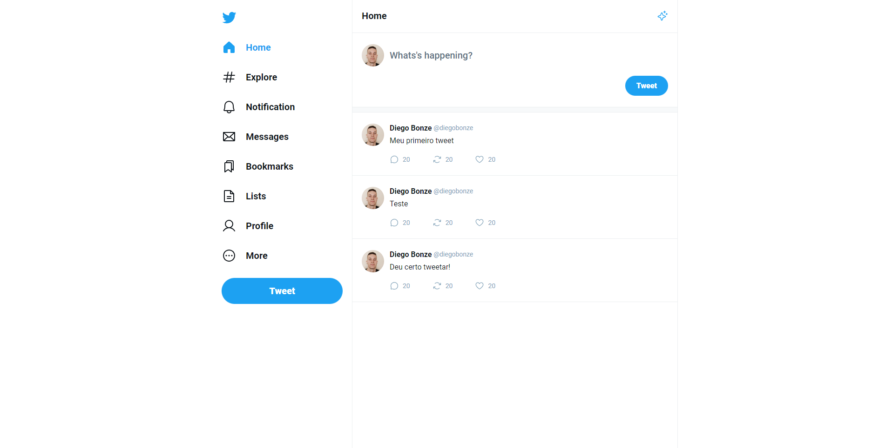
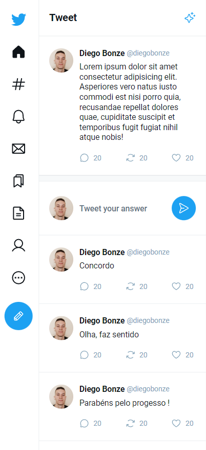

<h1 align="center"> Masterclass React </h1>

Evento exclusivo e gratuito, promovido pela Rocketseat para ensino de tecnologias WEB.

  <a href="#-tecnologias">Tecnologias</a>&nbsp;&nbsp;&nbsp;|&nbsp;&nbsp;&nbsp;
  <a href="#-projeto">Projeto</a>&nbsp;&nbsp;&nbsp;|&nbsp;&nbsp;&nbsp;
  <a href="#-layout">Layout</a>&nbsp;&nbsp;&nbsp;|&nbsp;&nbsp;&nbsp;

 

  

  

Projeto desenvolvido através do MasterClass-React pela Rocketseat

[🔗 Clique aqui para acessar](https://master-class-tweet.vercel.app/)

## 🚀 Tecnologias

Esse projeto foi desenvolvido com as seguintes tecnologias:

- HTML e CSS
- [React](https://reactjs.org/)
- [TypeScript](https://www.typescriptlang.org/)
- [Vite](https://vitejs.dev/)

## 💻 Projeto

- Introdução ao React com Typescript
- Criação do HTML e CSS
- Separação dos Componentes
- Iterações/Laço de repetição { .map }
- Roteamento ( Layouts reaproveitáveis )
- Estados ( useState )
- Layout responsivo

## 🔖 Layout

Você pode visualizar o layout do projeto através [DESSE LINK](https://www.figma.com/file/z1xBpAvqkNwmpZ07Yn2PIm/Twitter-UI-(Community)?node-id=1%3A937&t=Xa3oTZMb9fbcDhZ3-0). É necessário ter conta no [Figma](https://figma.com) para acessá-lo.

## 💜 Contatos

[LinkedIn](https://www.linkedin.com/in/diego-bonze-518225208/)

diegobonze747@gmail.com
